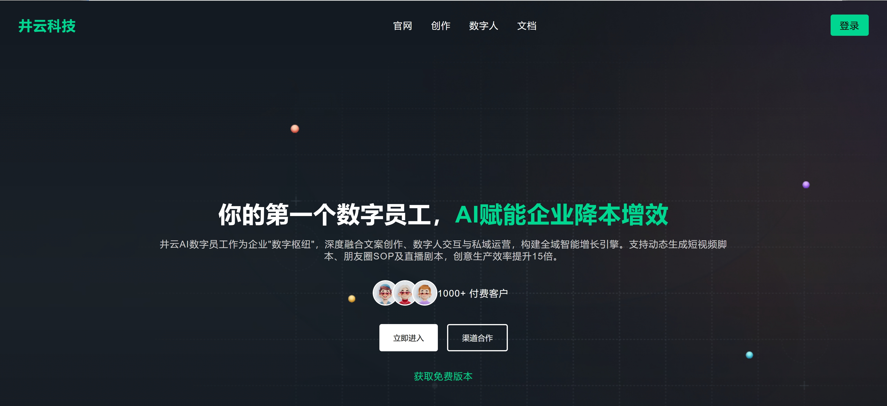
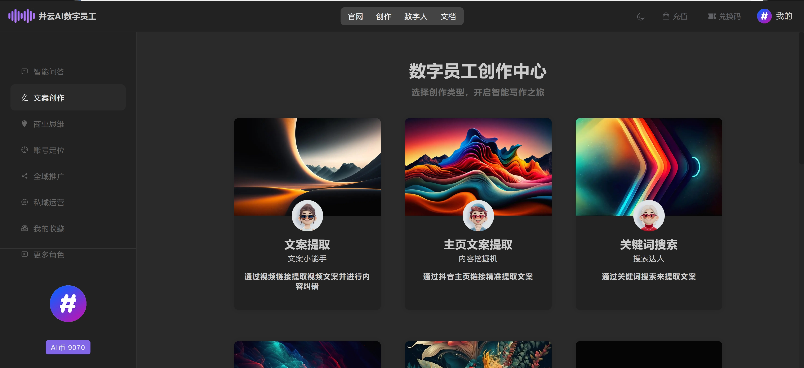
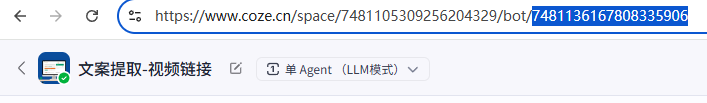
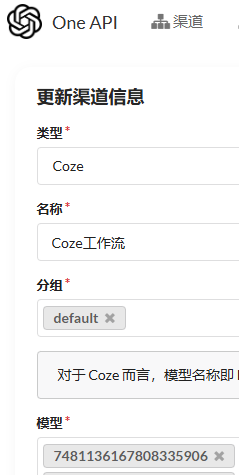

# 井云AI数字员工 Jingyun_Agent
## JINGYUN.AI

## 核心功能
- 快速接入扣子工作流/智能体
- 开箱即用、前端接入数字员工、集成支付能力
## 什么是 Jingyun_Agent  数字员工
Jingyun_Agent 你的第一个数字员工，提供抖音链接文案提取，关键词提取，主页提取，文案撰写，账号定位等智能体工作流，Jingyun_Agent 系统是一个面向智能体创业者提供集成平台，基于 TIME-SEA-ChatGPT 框架修改，支持扣子工作流API接入，提示词配置，系统适配了 PC Web 端和手机端，框架提供了 亮色 和 暗色 两个主题。除此之外，还提供了支付的配置，开发者自主使用其添加扣子智能体。

更多关于 Jingyun_Agent，请访问官网： [jingyun.ai](https://jingyun.ai)

### 前言
- 为什么做这样一个事情，最近网上很多做扣子搭建智能体/工作流培训的，搭建好了智能体却不知道怎么变现，没有适合的系统做集合，正好在社区刷到了一个TIME-SEA-ChatGPT框架，就萌发了把这个改造一下，接入扣子工作流，加入数字员工的概念，同样也是开源给大家研究，方便大家快速进行智能体变现，无需任何授权，免费商用！
- 预览地址
https://szyg.jingyuncenter.com/   （不要订购，直接联系客服给激活码）

###  Jingyun_Agent 的与众不同之处
1. AI创业者的福音
- Jingyun_Agent 的目标是打造一个智能体共创平台，同时支持对接COZE扣子工作流，允许用户使用接入自己搭建的工作流。 不仅如此，Jingyun_Agent 提供对话功能和表单功能，根据不同的场景，选用不同的对话场景。

2. 简单、友好、易用
- Jingyun_Agent 基于 TIME-SEA-ChatGPT 开发，页面简洁。Jingyun_Agent 使用 Apache-2.0 开源协议，放心商用。

3. 除了开源版，还提供商业 Pro 版
- Jingyun_Agent 除了开源版以外，我们还准备提供功能更加强大的商业 Pro 版，无需自己搭建服务器，针对无代码能力的创业者，同时提供技术和运营团队支持，敬请期待！

### 主要功能以及特性
- AI数字员工对接Coze工作流（新增）
- 网页支持邮箱短信注册登录
- 黑夜/日间 主题切换
- Web 对话记忆(历史对话记录)
- 支付宝微信支付
- GPT 流对话
- AI 币兑换码 (可通过微信支付宝充值)
- 内置后台管理 (用户管理 服务器管理 兑换码管理)

基于 TIME-SEA-ChatGPT 开发 https://github.com/dulaiduwang003/TIME-SEA-chatgpt  
开源不易，有能力的可以去打赏框架原作者！

## 部署环境

`JDK17`
`Redis 7`
`MySQL 8`

## 部署教程
- 部署可参考 TIME-SEA-ChatGPT 教程
https://github.com/dulaiduwang003/TIME-SEA-chatgpt  
- 具体API配置可参考以下方式
- 将Coze智能体的Bot ID复制到One API的模型中，系统即可调用
